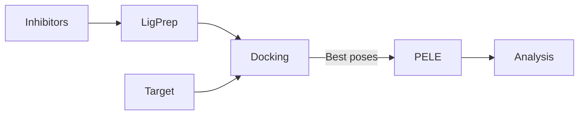

# DockingProtocol

Repository to create a concrete workflow to work with in drug discovery projects.

For a **usage example** please go to the **examples/** folder where you can see a notebook where of some of the classes and methods of this library are used.

## Requirements

Other than the requirements specified at requirements.txt, you should have installed the Schrödinger's suite.

## Workflow

---

### 1. Input

1. Target to inhibit prepared and in format pdb.
2. Csv file with only SMILES and id of all the inhibitor ligands.

**- Module:** inputPrepare.py

**- Class:** InputPreparation

**- Methods:** setUpLigPrepJob, and setUpQMParametrization

#### 1.1. Ligprep

Generation of tautomers and isomers as well as protonation and 3D conformation of the inhibitor ligands in selected pH +- pH_tolerance.

#### 1.2. QM with Jaguar

In case you want to calculate the RESP charges of a specific ligand the input required is just a pdb of the ligand.

---

### 2. Docking

Docking of the inhibitors to the target or rescoring docked poses. You will need a **grid** file for the Glide dockings. For the analysis you will need **experimental data** with which compare.

**Modules:** 
1. dockingJob.py 

	**- Class:** DockingJob
	
	**- Methods:** setGlideDocking, setRdockDockingset, setEquibindDocking, rDockRescore, and glideRescore
	
2. dockingAnalysis.py

	**- Class:** DockingAnalyzer

	**- Methods:** glideAnalysis, rdockOutputToDataFrame, and rdockAnalysis

---

### 3. PELE

Refinement of the docking pose obtained in the previous step in the pipeline. **The best pose is chosen as the isomer of the ligand that has the best docking score according to the docking tool scoring function**.

**- Module:** peleJob.py

**- Class:** PELEJob

**- Methods:** setGlideToPELESimulation, setRdockToPELESimulation, setEquibindToPELESimulation, and PELEDownloader.

---

### 4. Analysis

Part to analyze the results obtained in the PELE simulations.

**- Module:** peleAnalysis.py

**- Class:** PELEAnalyzer

**- Methods:** experimentalDataCollector, equibindDataTrimming, PELEDataCollector, correlationPlotter, and simulationAnalyzer

---
