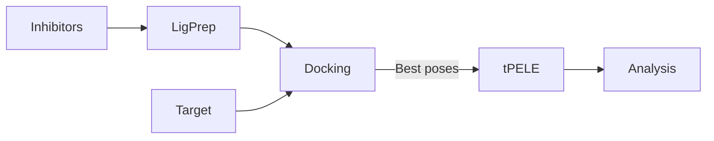

# DockingProtocol

Repository to create a concrete workflow to work with in drug discovery projects.

## Workflow

---

### 1. Input

1. Target to inhibit prepared and in format pdb, mol2 or sdf.
2. Csv file with only SMILES and id of all the inhibitor ligands.

**Module:** inputPrepare.py
**Class:** InputPreparation
**Methods:** setUpLigPrepJob

#### 1.1. Ligprep

Generation of tautomers and isomers as well as protonation of the inhibitor ligands in selected pH +- pH_tolerance.

---

### 2. Docking

Docking of the inhibitors to the target.

**Modules:** 
1. dockingJob.py 
	**Class:** DockingJob
	**Methods:** setGlideDocking, setRdockDockingset, and EquibindDocking
2. dockingAnalysis.py
	**Class:** DockingAnalyzer
	**Methods:** glideAnalysis, rdockAnalysis

---

### 3. tPELE

Refinement of the docking pose obtained in the previous step in the pipeline.

**Module:** peleJob.py
**Class:** PELE
**Methods:** setGlideToPELESimulation, setRdockToPELESimulation, and setEquibindToPELESimulation

---

### 4. Analysis

Part to analyze the results obteined in the tPELE simulations.

---
